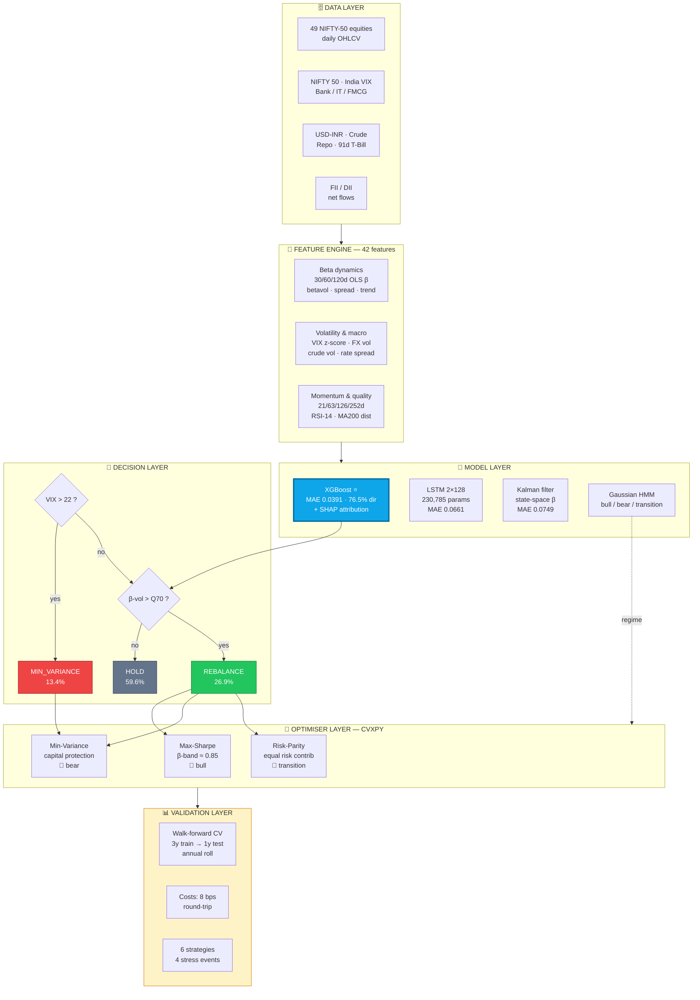
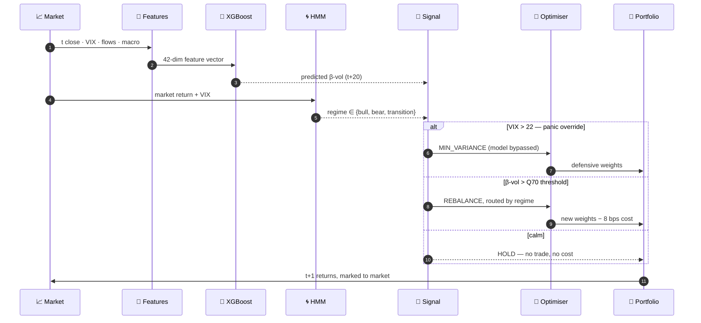

<div align="center">


### 🧠 AI-Powered Dynamic Beta Forecasting & Regime-Aware Portfolio Construction
#### *An event-triggered alternative to calendar rebalancing — built and validated on NIFTY-50, 2015 → 2026*

<br/>

[](https://python.org)
[](https://pytorch.org)
[](https://xgboost.ai)
[](https://cvxpy.org)
[](https://nextjs.org)
[](#-license)

<br/>


<br/>

**[📊 Results](#-results--walk-forward-out-of-sample) · [🏗 Architecture](#-system-architecture) · [🧪 Models](#-the-model-zoo--four-families-one-benchmark) · [⚡ Quickstart](#-quickstart) · [🖥 Dashboards](#-three-ways-to-explore-the-results) · [📁 Structure](#-repository-map)**

</div>

---

<div align="center">

## ⚡ The One-Line Version

> ### Classical CAPM assumes beta is constant. It isn't.
> ### We forecast *when beta becomes unstable* — and rebalance only then.
> ### Result: **half the volatility, half the drawdown**, best-in-class Sortino & Calmar.

</div>

---

## 🎯 The Problem

**Beta** — a stock's sensitivity to the market — is the single most-used number in portfolio construction. Every mean-variance optimiser, every risk model, every hedge ratio depends on it.

And almost everyone treats it as a **constant**.

It isn't. Beta drifts with regimes, macro shocks and sector rotation — and it often moves **before** the market does:

<table>
<tr>
<td width="33%" align="center"><h3>📉</h3><b>COVID Crash, 2020</b><br/><sub>RELIANCE.NS beta went from<br/><b>~1.00 → ~1.65 in six weeks</b></sub></td>
<td width="33%" align="center"><h3>🏦</h3><b>IL&FS Crisis, 2018</b><br/><sub>NBFC-sector betas surged<br/><b>weeks before</b> the equity selloff</sub></td>
<td width="33%" align="center"><h3>⚠️</h3><b>The Consequence</b><br/><sub>Stale beta ⇒ your <b>real</b> risk exposure<br/>diverges exactly when it matters</sub></td>
</tr>
</table>

> **The core insight of this project:** you don't actually need to predict *beta*. You need to predict **beta *volatility*** — the instability of the exposure itself. That's the signal that tells you when your risk model is about to be wrong, and it is *far* more forecastable than returns.

---

## 💡 The Approach

Rather than rebalancing on a calendar (monthly, quarterly — arbitrary, cost-heavy, blind to stress), **AdaptiveBeta rebalances only when a model predicts that beta instability is about to spike.**

```
                   ╔══════════════════════════════════════════════════╗
   42 features ───▶ ║  XGBoost  ⟶  predicted 20-day forward betavol   ║ ───▶ signal
   (β · VIX · macro ║                                                  ║
    · flows · rates ║  compare against calibrated Q70 threshold        ║
    · sector · mom) ╚══════════════════════════════════════════════════╝
                                          │
              ┌───────────────────────────┼────────────────────────────┐
              ▼                           ▼                            ▼
        VIX > 22                   betavol > 0.1794              otherwise
      MIN_VARIANCE                   REBALANCE                      HOLD
     (13.4% of days)               (26.9% of days)             (59.6% of days)
       capital armour            regime-routed optimiser        zero cost drag
```

**Three things make this work:**

1. 🎯 **Forecast the instability, not the level.** The target is 20-day-ahead 60-day rolling beta volatility — a quantity with real autocorrelation structure, unlike returns.
2. 🚦 **Act asymmetrically.** A VIX override short-circuits the model in genuine panic. Machine learning is for the ambiguous 87% of days; hard rules own the tail.
3. 💰 **Do nothing, most of the time.** 59.6% HOLD days means transaction costs are paid only when the risk case justifies them.

---

## 🏗 System Architecture



### 🔄 The Decision Loop, Day by Day



### 🛡 Constraints Baked Into Every Optimisation

| Constraint | Value | Why it exists |
|---|---|---|
| Max single-name weight | **15%** | Idiosyncratic blow-up protection |
| Min position weight | **1%** | Kills unimplementable dust weights |
| Max sector weight | **35%** | 8 sector groups — no accidental all-financials book |
| Portfolio beta band | **≈ 0.85** | The whole point: exposure is *targeted*, not inherited |
| Covariance estimator | **Ledoit-Wolf shrinkage** | 49 assets on short windows — sample covariance is unusable |
| Transaction cost | **8 bps round-trip** | 5 bps brokerage + 3 bps slippage, charged on turnover |

---

## 🧪 The Model Zoo — Four Families, One Benchmark

Four model families were implemented and benchmarked **on the identical forward-looking task**: predict 20-day-ahead beta volatility.

<div align="center">

| Model | MAE ⬇ | Directional Acc | Verdict |
|:---|:---:|:---:|:---|
| 🏆 **XGBoost + SHAP** | **0.0391** | **76.5%** | **Selected as the production signal model** |
| Static 60d rolling OLS | 0.0477 | — | Classical baseline — respectable, unadaptive |
| LSTM (2×128, 230,785 params) | 0.0661 | 50.4% | Negative result — see below |
| Kalman filter (state-space EM) | 0.0749 | — | Smooth β estimates, poor at forecasting *instability* |

</div>

> ### 🔍 Honest negative result: the deep model lost.
> The LSTM early-stopped at epoch 12 with 50.4% directional accuracy — **a coin flip**. Diagnosis: with a Huber objective on a small, noisy, low-signal-to-noise financial panel, the network converged to predicting the conditional mean rather than learning the dynamics. Gradient boosting on well-engineered features beat it decisively.
>
> This is reported rather than buried. *Choosing the right model matters more than choosing the fanciest one*, and demonstrating that with a controlled comparison is the point of the experiment.

### 🎨 What the Model Actually Learned — SHAP Attribution

<div align="center">

| # | Feature | mean \|SHAP\| | Interpretation |
|:--:|:---|:---:|:---|
| 1 | `betavol_60` | **0.0280** | 🥇 Beta instability is strongly autocorrelated |
| 2 | `betavol_trend` | **0.0205** | 🥈 The *direction* of instability carries real signal |
| 3 | `betavol_30` | **0.0132** | 🥉 Short-horizon confirmation |
| 4 | `market_vol_60d` | 0.0074 | Market-wide vol leaks into beta stability |
| 5 | `betavol_120` | 0.0037 | Long-horizon regime anchor |
| 6 | `combined_flow` | 0.0036 | **FII + DII flows — India-specific alpha** |
| 7 | `beta_60_30_spread` | 0.0028 | Term structure of beta |
| 8 | `beta_120` | 0.0023 | Structural exposure level |
| 9 | `vix_zscore` | 0.0022 | Normalised fear, not raw fear |
| 10 | `rfr` | 0.0014 | Risk-free rate backdrop |

</div>

The top three predictors are all beta-volatility measures — **beta instability clusters, exactly the way return volatility clusters.** That's the empirical result the entire strategy is built on, and SHAP confirms the model found it rather than being told it.

<div align="center">

</div>

### 🧬 Feature Universe — 42 Engineered Features

| Group | Features |
|:---|:---|
| **Beta dynamics** | 30/60/120d rolling OLS β, β-vol at each window, 60–30 spread, β-vol trend |
| **Volatility** | India VIX level, 5d/20d change, z-score, >25 flag, market vol 20d/60d |
| **Macro** | USD-INR 5d change & 20d vol, crude 5d change & 20d vol |
| **Rates** | RBI repo rate, 91-day T-bill yield, rate spread |
| **Market** | NIFTY-50 5d/20d return, realised vol |
| **Sector** | Bank / IT / FMCG 10d momentum, Bank-vs-NIFTY spread |
| **Flows** 🇮🇳 | FII net, DII net, combined flow, FII/DII ratio |
| **Stock-specific** | 21/63/126/252d momentum, RSI-14, MA-200 distance, realised vol |

---

## 📊 Results — Walk-Forward, Out-of-Sample

<div align="center">

**Data:** 2015-01-02 → 2026-02-23 (2,744 trading days) · **OOS:** 2022-01-03 → 2026-01-23 (1,964 days)
**Protocol:** 3-year train → 1-year test → annual roll · strictly chronological · **8 bps costs charged on every rebalance**

</div>

### 🏁 The Scoreboard

| Strategy | CAGR | Sharpe | **Sortino** | **Max DD** | **Calmar** | **Ann. Vol** | Alpha | β |
|:---|:---:|:---:|:---:|:---:|:---:|:---:|:---:|:---:|
| 🛡️ **AdaptiveBeta (ours)** | 9.24% | 0.785 | **1.047** 🥇 | **−17.36%** 🥇 | **0.532** 🥇 | **11.26%** 🥇 | **+4.24%** | **0.40** |
| Static CAPM MVO | 11.38% | 0.587 | 0.716 | −35.33% | 0.322 | 18.35% | +1.19% | 0.84 |
| Kalman-β MVO | 10.92% | 0.561 | 0.676 | −35.44% | 0.308 | 18.48% | +0.58% | 0.85 |
| Equal Weight | 15.86% | 0.864 | 0.992 | −38.23% | 0.415 | 17.04% | +3.85% | 0.95 |
| Buy & Hold NIFTY-50 | 12.16% | 0.668 | 0.781 | −38.44% | 0.316 | 17.19% | — | 1.00 |
| Momentum-Quality | 17.47% | **0.893** | 1.028 | −38.51% | 0.454 | 18.03% | +4.90% | 0.92 |

<div align="center">

<table>
<tr>
<td align="center" width="25%"><h2>−17.4%</h2><b>Max Drawdown</b><br/><sub>vs −35% to −38.5%<br/>everywhere else</sub><br/><br/>🥇 <b>2.2× better</b></td>
<td align="center" width="25%"><h2>11.3%</h2><b>Annual Volatility</b><br/><sub>vs 17–18.5%<br/>for every benchmark</sub><br/><br/>🥇 <b>~35% lower</b></td>
<td align="center" width="25%"><h2>1.047</h2><b>Sortino Ratio</b><br/><sub>best downside-risk-<br/>adjusted return</sub><br/><br/>🥇 <b>#1 of 6</b></td>
<td align="center" width="25%"><h2>0.532</h2><b>Calmar Ratio</b><br/><sub>return per unit<br/>of drawdown</sub><br/><br/>🥇 <b>#1 of 6</b></td>
</tr>
</table>

</div>

<div align="center">


<br/>
<sub><i>Left: cumulative wealth. Right: the underwater plot — where AdaptiveBeta wins, and wins decisively.</i></sub>
</div>

### 🧭 Reading These Results Honestly

**AdaptiveBeta does not have the highest CAGR — and it was never designed to.**

It runs at a market beta of **0.40**. It is structurally ~60% less exposed to the index than every benchmark in the table. Over a 2022–2026 window in which Indian equities generally rose, *any* defensive strategy will trail a long-only book on raw return. That is arithmetic, not underperformance.

The question that matters is **what you got in exchange for that give-up**:

| Comparison vs Buy & Hold NIFTY-50 | Result |
|:---|:---|
| CAGR given up | −2.9 pts (9.24% vs 12.16%) |
| Max drawdown avoided | **−21.1 pts** (−17.36% vs −38.44%) |
| Volatility removed | **−5.9 pts** (11.26% vs 17.19%) |
| Sortino gained | **+34%** (1.047 vs 0.781) |
| Calmar gained | **+68%** (0.532 vs 0.316) |
| Alpha generated | **+4.24%** annualised at β = 0.40 |

Give up 2.9 points of return; remove 21 points of drawdown. **On a leverage-adjusted basis this is the strongest risk-adjusted book in the comparison set** — an 11.26% vol strategy can be levered toward benchmark vol; a −38% drawdown cannot be un-levered after the fact.

### 🔥 Stress Testing — The Real Test

Four genuine Indian-market dislocations, all inside the walk-forward out-of-sample window:

| Event | 🛡️ **AdaptiveBeta** | Static MVO | Kalman MVO | Equal Wt | NIFTY-50 | Momentum-Q |
|:---|:---:|:---:|:---:|:---:|:---:|:---:|
| **COVID Crash** *(Feb–May 2020)* | | | | | | |
| ↳ Cumulative return | **−7.18%** 🥇 | −10.42% | −10.56% | −18.94% | −17.57% | −15.47% |
| ↳ Max drawdown | **−8.97%** 🥇 | −35.33% | −35.44% | −37.63% | −37.63% | −38.51% |
| **ADANI Crisis** *(Jan–Mar 2023)* | | | | | | |
| ↳ Cumulative return | −6.66% | −10.19% | −11.07% | −6.66% | **−6.33%** | −6.56% |
| ↳ Max drawdown | **−5.87%** 🥇 | −13.71% | −14.25% | −5.87% | −5.90% | −7.08% |
| **2018 Rate Hike** *(Sep–Nov 2018)* | | | | | | |
| ↳ Cumulative return | −7.51% | −9.61% | −9.86% | −7.51% | **−6.88%** | −8.75% |
| ↳ Max drawdown | −12.86% | −14.33% | −14.43% | −12.86% | −13.45% | **−12.44%** |
| **IL&FS Crisis** *(Aug–Oct 2018)* | | | | | | |
| ↳ Cumulative return | **−6.01%** 🥇 | −7.91% | −7.89% | −6.01% | −8.54% | −6.42% |
| ↳ Max drawdown | **−13.54%** 🥇 | −15.85% | −15.90% | −13.54% | −14.55% | −13.84% |

<div align="center">

> ### 💥 The COVID number is the headline.
> ### **−8.97%** drawdown versus **−35.33%** for standard mean-variance optimisation.
> The VIX override fired, min-variance mode engaged, and the portfolio de-risked *while the crash was happening* — not after. **A 26-point drawdown differential in the single worst equity event of the decade.**


</div>

### 🌀 Regime Detection & Signal Behaviour

<div align="center">


</div>

<table>
<tr><td valign="top" width="50%">

**HMM regime distribution** *(2015–2021 train)*

| Regime | Days | Share |
|:---|---:|---:|
| 🐻 Bear | 1,317 | 47.9% |
| 🔄 Transition | 1,162 | 42.3% |
| 🐂 Bull | 260 | 9.5% |

</td><td valign="top" width="50%">

**Signal distribution**

| Signal | Days | Share |
|:---|---:|---:|
| 😴 HOLD | 1,025 | **59.6%** |
| ⚖️ REBALANCE | 463 | 26.9% |
| 🛡️ MIN_VARIANCE | 231 | 13.4% |

</td></tr>
</table>

**Nearly 60% of days require no trade at all** — the direct source of the cost advantage over calendar rebalancing.

### 📐 Optimiser Modes — Cross-Sectional Snapshot

Diagnostic comparison of the three optimiser modes on the same covariance estimate at **2021-12-31**:

| Mode | Expected Return* | Ann. Vol | Sharpe* | Portfolio β | # Stocks | Max Weight |
|:---|:---:|:---:|:---:|:---:|:---:|:---:|
| Max-Sharpe (β-constrained) | 60.83%* | 17.34% | 3.133* | 0.850 | 11 | 15.0% |
| Min-Variance | 12.38% | 10.84% | 0.542 | 0.602 | 21 | 15.0% |
| Risk-Parity | 12.38% | 10.84% | 0.542 | 0.602 | 21 | 15.0% |

> \* **Read with care.** These are *in-sample optimiser objective values* at a single date from historical mean returns — the classic Markowitz estimation-error inflation, not realised performance. They are included as an optimiser diagnostic. The realised, cost-inclusive, out-of-sample numbers are in [the scoreboard](#-the-scoreboard) above.
>
> Risk-Parity fell back to Min-Variance weights at this date (CVXPY reported no feasible risk-parity solution for that covariance conditioning) — logged rather than silently swallowed.

<div align="center">


<br/><sub><i>1-year rolling Sharpe — stability of the risk-adjusted profile through time.</i></sub>
</div>

---

## 🔬 Methodological Rigour

Everything below exists to make the results **believable**, not flattering.

<table>
<tr><td width="4%">✅</td><td width="30%"><b>Walk-forward CV</b></td><td>3-year train → 1-year test → annual roll. The model is retrained on each window and never sees its test year.</td></tr>
<tr><td>✅</td><td><b>Zero lookahead</b></td><td>Every split is strictly chronological. Time series are <b>never</b> shuffled. Targets are forward-shifted 20 days.</td></tr>
<tr><td>✅</td><td><b>Costs charged</b></td><td>8 bps round-trip on turnover at every rebalance — no frictionless fantasy.</td></tr>
<tr><td>✅</td><td><b>Threshold calibrated in-sample only</b></td><td>Q70 = 0.1794 comes from <i>training-period</i> predictions and is then frozen.</td></tr>
<tr><td>✅</td><td><b>Scaler fit on train only</b></td><td><code>StandardScaler</code> fitted on training data, applied to test — no distributional leakage.</td></tr>
<tr><td>✅</td><td><b>Shrinkage covariance</b></td><td>Ledoit-Wolf for all 49×49 estimates — sample covariance is ill-conditioned at this ratio.</td></tr>
<tr><td>✅</td><td><b>Survivorship handled</b></td><td>TMPV.NS excluded (87 post-demerger rows). HDFCLIFE/SBILIFE pre-IPO rows explicitly zero-return, not silently forward-filled.</td></tr>
<tr><td>✅</td><td><b>Data quirks documented</b></td><td>WTI's negative 2020-04-20 print clipped to 0. FII/DII monthly flows forward-filled with the ≤1-month lag stated openly.</td></tr>
<tr><td>✅</td><td><b>Reproducible</b></td><td>All seeds fixed at 42. Device auto-detect: CUDA → MPS → CPU.</td></tr>
<tr><td>✅</td><td><b>Six benchmarks, not one</b></td><td>Including two that beat us on CAGR — reported, not hidden.</td></tr>
</table>

### ⚖️ Known Limitations

Stated plainly, because a backtest that claims no weaknesses is a backtest that hasn't been examined:

- **Long-only, no leverage.** The natural next step is vol-targeting AdaptiveBeta up to benchmark volatility, where its risk-adjusted edge would translate into absolute return.
- **Single market, single universe.** NIFTY-50 constituents only; cross-market generalisation is untested.
- **Monthly FII/DII flows** are forward-filled to daily, introducing up to a one-month information lag on that feature group.
- **Close-price execution** is assumed; no intraday microstructure or partial-fill modelling.
- **Fixed cost model** (8 bps) does not scale with order size or liquidity conditions.
- **Regime labels are unsupervised** — HMM states are interpreted post-hoc by sorted mean return, not validated against an external regime taxonomy.

---

## ⚡ Quickstart

```bash
# 1 — Clone
git clone https://github.com/daishinkan7/FinTech_AdaptiveBeta.git
cd FinTech_AdaptiveBeta

# 2 — Environment
python -m venv venv && source venv/bin/activate      # Windows: venv\Scripts\activate
pip install -r requirements.txt

# 3 — Run the whole thing
python run_pipeline.py
```

### 🎛 Pipeline Options

```bash
python run_pipeline.py                 # full pipeline, auto device select
python run_pipeline.py --device cpu    # force CPU
python run_pipeline.py --fast          # skip Kalman betas (~20 min saved)
python run_pipeline.py --start 3       # resume from stage 03
```

### 🪜 Or Stage by Stage

| Stage | Script | Runtime | Produces |
|:--:|:---|:---:|:---|
| **01** | `scripts/01_feature_engineering.py` | ~10 s | 118,719 × 44 stacked feature matrix |
| **02** | `scripts/02_train_models.py --device auto` | ~8–10 min | XGBoost · LSTM · Kalman · HMM + SHAP |
| **03** | `scripts/03_portfolio_optimisation.py` | ~1 s | Validated weights for all three modes |
| **04** | `scripts/04_backtest.py` | ~25–30 min | Walk-forward results, metrics, all charts |

**Stage 02 flags:** `--device {auto,cuda,mps,cpu}` · `--epochs N` · `--fast` (skip Kalman) · `--no-xgb` (skip XGBoost + SHAP)

### 📥 Data Layout

```
data/
├── stocks/    all_stocks_prices.csv · all_stocks_volume.csv
├── market/    nifty50.csv · india_vix.csv
├── macro/     usdinr.csv · crude_oil.csv · risk_free_rate_91d_daily.csv · repo_rate_daily.csv
├── flows/     fii_flows.csv · dii_flows.csv          (monthly)
└── sector/    nifty_bank.csv · nifty_it.csv · nifty_fmcg.csv
```

> **Minimum viable input:** `stocks/all_stocks_prices.csv` + `market/nifty50.csv`. Macro, flow and sector feeds **degrade gracefully** — the pipeline drops those feature groups with a warning rather than crashing.

---

## 🖥 Three Ways to Explore the Results

<table>
<tr>
<td width="33%" align="center">

### 🌐 Next.js Site
Production research site — architecture walkthrough, results, and a **browser-side interactive strategy simulator** driven by real exported backtest data.

```bash
cd website
npm install && npm run dev
```
`localhost:3000`

<sub>Next 14 · TypeScript · Tailwind · Recharts · Framer Motion</sub>

</td>
<td width="33%" align="center">

### 📊 Plotly Dash
Full analyst dashboard — equity curves, drawdowns, regime timeline, SHAP explorer, live signal inspection.

```bash
python app.py
```
`localhost:8050`

<sub>Dash · Bootstrap · Plotly</sub>

</td>
<td width="33%" align="center">

### 🧪 Strategy Lab
Threshold sweeps, VIX-override sensitivity and regime-routing what-ifs — for probing *why* the strategy behaves as it does.

```
src/dashboard/strategy_lab.py
```

<sub>Parameter-sensitivity tooling</sub>

</td>
</tr>
</table>

---

## 📁 Repository Map

```
FinTech_AdaptiveBeta/
│
├── 📂 src/                          ← layered library (the real codebase)
│   ├── config.py                    ← single source of truth: paths, tickers, hyperparams
│   ├── data/       loader.py · validator.py
│   ├── features/   returns.py · beta.py · macro.py · momentum.py
│   ├── models/     xgboost_model.py · lstm.py · kalman.py · hmm_regime.py
│   ├── portfolio/  signal.py · optimiser.py · constraints.py
│   ├── backtest/   engine.py · metrics.py · transaction_costs.py
│   ├── dashboard/  layout.py · callbacks.py · charts.py · data_service.py · strategy_lab.py
│   └── utils/      logging.py · plotting.py
│
├── 📂 scripts/                      ← 01 features → 02 train → 03 optimise → 04 backtest
├── 📂 data/                         ← raw market / macro / flow / sector CSVs
├── 📂 features/                     ← computed panels: β, β-vol, Kalman β, HMM regimes, targets
├── 📂 models/                       ← xgb_model.pkl · lstm_best.pt · scaler.pkl · signal_config.json
├── 📂 results/                      ← metrics CSVs + 12 publication-grade charts
├── 📂 website/                      ← Next.js 14 research site + interactive demo
├── 📂 docs/                         ← SETUP_GUIDE.md · RESULTS.md (full run log)
│
├── 🚀 run_pipeline.py               ← master orchestrator
├── 📊 app.py                        ← Plotly Dash dashboard
└── 📋 requirements.txt
```

<div align="center">

| | |
|:---|:---|
| **Python** | ~11,300 lines across a layered package |
| **TypeScript / React** | ~4,850 lines (Next.js 14 research site) |
| **Model families** | 4 — gradient boosting · deep learning · state-space · latent-regime |
| **Engineered features** | 42 |
| **Universe** | 49 NIFTY-50 constituents |
| **History** | 2,744 trading days (2015 → 2026) |
| **Benchmark strategies** | 6 |
| **Stress events** | 4 |

</div>

### 📦 Generated Artefacts

| Directory | Contents |
|:---|:---|
| `features/` | `stacked_features.csv` (118,719×44) · `market_features.csv` · `beta{30,60,120}d.csv` · `betavol_*.csv` · `kalman_betas.csv` (2,743×49) · `hmm_regimes.csv` · `target_betavol_20d_ahead.csv` · `optimiser_weights_*.csv` |
| `models/` | `xgb_model.pkl` · `lstm_best.pt` · `scaler.pkl` · `feature_cols.txt` · `signal_config.json` |
| `results/` | `performance_metrics.csv` · `stress_analysis.csv` · `model_comparison.csv` · `optimiser_comparison.csv` · `signal_frequency.csv` · `shap_importance.csv` · per-strategy return series · 12 charts |

---

## 🧰 Tech Stack

<div align="center">


</div>

---

## 📚 References

1. **Fama, E. F., & French, K. R.** (1993). Common risk factors in the returns on stocks and bonds. *Journal of Financial Economics*, 33(1), 3–56.
2. **Ang, A., & Kristensen, D.** (2012). Testing conditional factor models. *Journal of Financial Economics*, 106(1), 132–156.
3. **Kalman, R. E.** (1960). A new approach to linear filtering and prediction problems. *Journal of Basic Engineering*, 82(1), 35–45.
4. **Ledoit, O., & Wolf, M.** (2004). A well-conditioned estimator for large-dimensional covariance matrices. *Journal of Multivariate Analysis*, 88(2), 365–411.
5. **Black, F., & Litterman, R.** (1992). Global portfolio optimization. *Financial Analysts Journal*, 48(5), 28–43.
6. **Chen, T., & Guestrin, C.** (2016). XGBoost: A scalable tree boosting system. *KDD '16*.
7. **Hochreiter, S., & Schmidhuber, J.** (1997). Long short-term memory. *Neural Computation*, 9(8), 1735–1780.
8. **Lundberg, S. M., & Lee, S.-I.** (2017). A unified approach to interpreting model predictions. *NeurIPS 2017*.

---

## ⚠️ Disclaimer

This is an academic research project. Backtested results are hypothetical, carry the inherent limitations of simulated performance, and are **not** indicative of future returns. Nothing here constitutes investment advice.

---

## 📄 License

Released under the **MIT License** — free to use, modify and distribute.

---

<div align="center">

### 👤 Kunal Ajgaonkar
**AI & ML Engineer** · M.Tech Capstone, Symbiosis Institute of Technology, Pune · 2026

<sub>Built end to end: data engineering → feature research → model benchmarking → convex optimisation → walk-forward validation → production frontend.</sub>

<br/>

**If this was useful or interesting, a ⭐ is appreciated.**


</div>
