<div align="center">


<br/>

**AI-Powered Dynamic Beta Forecasting & Regime-Aware Portfolio Construction**
`NIFTY-50` · `2015 → 2026` · `2,744 trading days` · `walk-forward validated` · `costs included`

<br/>

[](https://python.org)
[](https://pytorch.org)
[](https://xgboost.ai)
[](https://cvxpy.org)
[](https://nextjs.org)
[](#-license)

</div>

<div align="center">

<table>
<tr>
<td align="center" width="16.6%">
<br/>
<h2>−17.4%</h2>
<b>MAX DRAWDOWN</b><br/>
<br/>
<sub><i>index: −38.4%</i></sub>
</td>
<td align="center" width="16.6%">
<br/>
<h2>11.26%</h2>
<b>ANNUAL VOL</b><br/>
<br/>
<sub><i>index: 17.19%</i></sub>
</td>
<td align="center" width="16.6%">
<br/>
<h2>1.047</h2>
<b>SORTINO</b><br/>
<br/>
<sub><i>index: 0.781</i></sub>
</td>
<td align="center" width="16.6%">
<br/>
<h2>0.532</h2>
<b>CALMAR</b><br/>
<br/>
<sub><i>index: 0.316</i></sub>
</td>
<td align="center" width="16.6%">
<br/>
<h2>76.5%</h2>
<b>DIRECTIONAL ACC</b><br/>
<br/>
<sub><i>XGBoost, OOS</i></sub>
</td>
<td align="center" width="16.6%">
<br/>
<h2>+4.24%</h2>
<b>ALPHA</b><br/>
<br/>
<sub><i>at 40% exposure</i></sub>
</td>
</tr>
</table>

<br/>

### ⟶ &nbsp; [📊 Results](#-results--walk-forward-out-of-sample) &nbsp;·&nbsp; [🏗 Architecture](#-system-architecture) &nbsp;·&nbsp; [🧪 Models](#-the-model-zoo--four-families-one-benchmark) &nbsp;·&nbsp; [🔬 Rigour](#-methodological-rigour) &nbsp;·&nbsp; [⚡ Quickstart](#-quickstart) &nbsp;·&nbsp; [🖥 Demos](#-three-ways-to-explore) &nbsp; ⟵

</div>

---

<div align="center">

```
╔═══════════════════════════════════════════════════════════════════════════╗
║                                                                           ║
║     Classical CAPM assumes beta is CONSTANT.  It isn't.                    ║
║                                                                           ║
║     We forecast WHEN beta becomes unstable — and rebalance only then.      ║
║                                                                           ║
║     ⟹  half the volatility   ·   half the drawdown   ·   #1 Sortino        ║
║                                                                           ║
╚═══════════════════════════════════════════════════════════════════════════╝
```

</div>

---

## 🎯 The Problem

**Beta** — a stock's sensitivity to the market — is the single most-used number in portfolio construction. Every mean-variance optimiser, every risk model, every hedge ratio depends on it. And nearly everyone treats it as a **constant**.

It isn't. Beta drifts with regimes, macro shocks and sector rotation — and it frequently moves **before** the market does.

<table>
<tr>
<td width="33%" valign="top" align="center">

### 📉
**COVID CRASH · 2020**

```
RELIANCE.NS beta

1.65 ┤              ╭────
     │            ╭─╯
1.40 ┤         ╭──╯
     │      ╭──╯
1.15 ┤   ╭──╯
     │ ╭─╯
1.00 ┼─╯
     └────────────────────
      Feb   Mar   Apr
```
**+65% in six weeks.**
Your risk model was wrong the whole way down.

</td>
<td width="33%" valign="top" align="center">

### 🏦
**IL&FS CRISIS · 2018**

```
  NBFC sector beta
        ▲
        │   ╭──╮
   β ───┼──╯   ╰──  ← beta spikes
        │
  ──────┼──────────
        │    ╲
 price  │     ╲___  ← price falls
        ▼      LATER
```
Beta led price by **weeks**.
The signal was there first.

</td>
<td width="33%" valign="top" align="center">

### ⚠️
**THE CONSEQUENCE**

```
  target β  ────────────  0.85
                ╱
  actual β  ───╯          1.40
            ▲
            └─ you are here,
               in the crisis,
               60% more exposed
               than you believe
```
Stale beta ⟹ real exposure diverges **exactly when it matters**.

</td>
</tr>
</table>

> ### 💡 The core insight
> You don't actually need to predict **beta**. You need to predict **beta *volatility*** — the instability of the exposure itself.
>
> That's the quantity that tells you *when your risk model is about to be wrong* — and unlike returns, **it is genuinely forecastable**, because instability clusters. Our SHAP analysis confirms it: the top three predictors of future beta-vol are all past beta-vol.

---

## 💡 The Approach

Instead of rebalancing on a calendar — monthly, quarterly, arbitrary, cost-heavy and blind to stress — **AdaptiveBeta rebalances only when a model predicts beta instability is about to spike.**

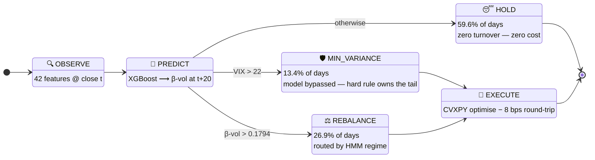

<table>
<tr>
<td width="33%" valign="top">

### 1️⃣ Forecast instability
Not the level. The target is **20-day-ahead 60-day rolling beta volatility** — a quantity with real autocorrelation structure, unlike returns.

</td>
<td width="33%" valign="top">

### 2️⃣ Act asymmetrically
A **VIX > 22 override** short-circuits the model in genuine panic. ML owns the ambiguous 87% of days; hard rules own the tail.

</td>
<td width="33%" valign="top">

### 3️⃣ Do nothing, mostly
**59.6% HOLD days.** Transaction costs are paid only when the risk case justifies them — the structural edge over calendar rebalancing.

</td>
</tr>
</table>

<div align="center">

<table><tr>
<td valign="top" width="50%" align="center">

**⚡ Signal distribution**

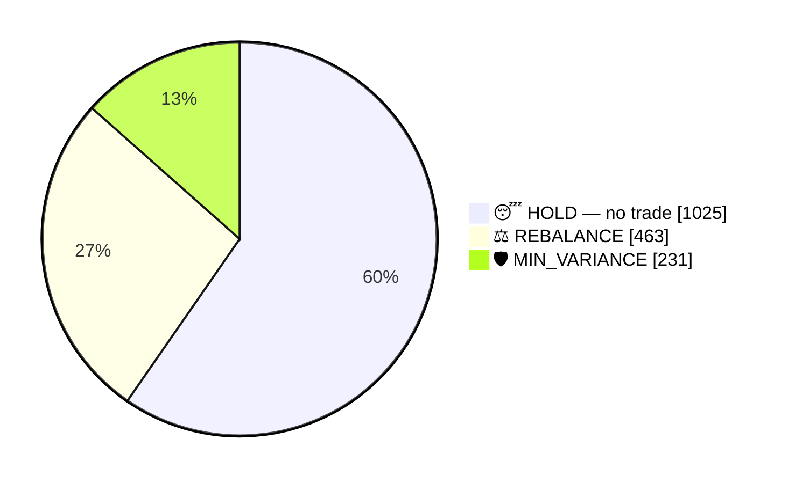

</td>
<td valign="top" width="50%" align="center">

**🌀 HMM regime distribution**

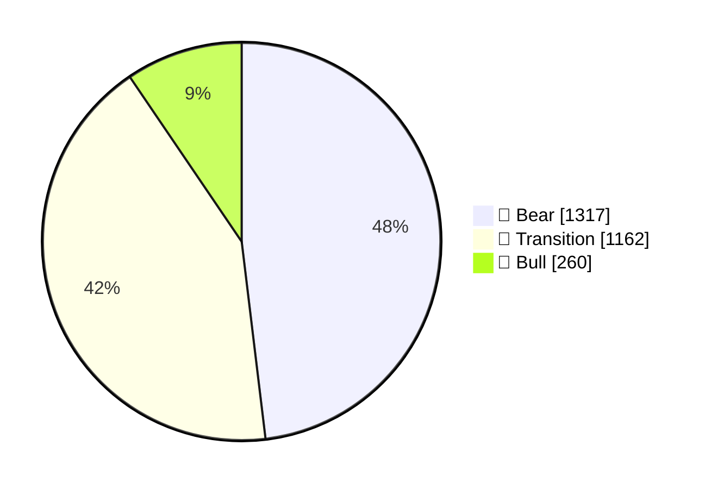

</td>
</tr></table>

</div>

---

## 🏗 System Architecture

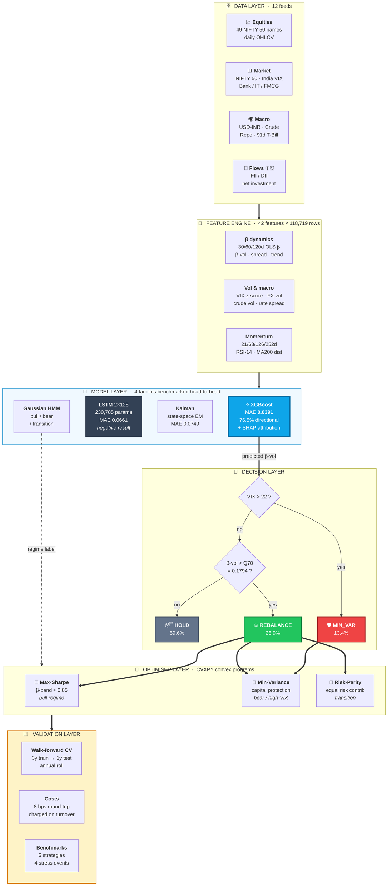

<details>
<summary><b>🔄 &nbsp;Expand: the decision loop, day by day (sequence diagram)</b></summary>

<br/>

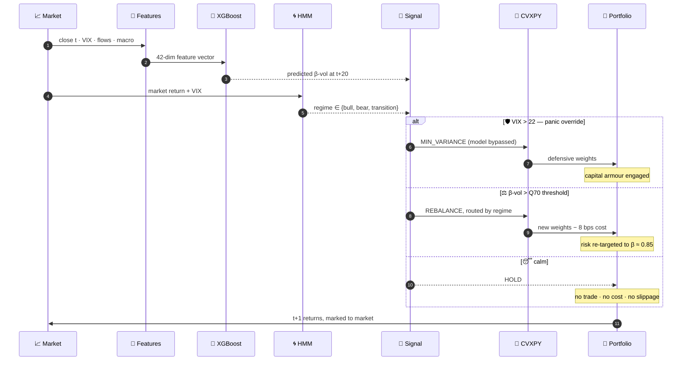

</details>

<details>
<summary><b>🛡️ &nbsp;Expand: constraints baked into every optimisation</b></summary>

<br/>

| Constraint | Value | Why it exists |
|:---|:---:|:---|
| Max single-name weight | **15%** | Idiosyncratic blow-up protection |
| Min position weight | **1%** | Kills unimplementable dust weights |
| Max sector weight | **35%** | 8 sector groups — no accidental all-financials book |
| Portfolio beta band | **≈ 0.85** | The entire point: exposure is *targeted*, not inherited |
| Covariance estimator | **Ledoit-Wolf** | 49 assets on short windows — sample covariance is ill-conditioned |
| Transaction cost | **8 bps** | 5 bps brokerage + 3 bps slippage, charged on turnover |

</details>

---

## 🧪 The Model Zoo — Four Families, One Benchmark

Four model families, implemented and benchmarked on the **identical forward-looking task**: predict 20-day-ahead beta volatility.

<div align="center">

| | Model | MAE ⬇ | Error profile *(lower = better)* | Directional |
|:--:|:---|:---:|:---|:---:|
| 🏆 | **XGBoost + SHAP** | **0.0391** | `████████████░░░░░░░░░░░░░░░░░░` | **76.5%** |
| 🥈 | Static 60d rolling OLS | 0.0477 | `███████████████░░░░░░░░░░░░░░░` | — |
| 🥉 | LSTM · 2×128 · 230,785p | 0.0661 | `██████████████████████░░░░░░░░` | 50.4% ⚠️ |
| 4 | Kalman filter · state-space EM | 0.0749 | `██████████████████████████████` | — |

</div>

> ### 🔍 Honest negative result: the deep model lost.
> The LSTM early-stopped at epoch 12 with **50.4% directional accuracy — a coin flip.**
>
> **Diagnosis:** with a Huber objective on a small, noisy, low-SNR financial panel, the network converged to predicting the *conditional mean* rather than learning the dynamics. Gradient boosting on well-engineered features beat it decisively — **69% lower error.**
>
> This is reported, not buried. Choosing the *right* model matters more than choosing the *fanciest* one, and proving that with a controlled comparison is the point of the experiment.

### 🎨 What the Model Actually Learned — SHAP Attribution

<div align="center">

| # | Feature | mean \|SHAP\| | Contribution | What it means |
|:--:|:---|:---:|:---|:---|
| 🥇 | `betavol_60` | **0.0280** | `██████████████████████████████` | Beta instability is **strongly autocorrelated** |
| 🥈 | `betavol_trend` | **0.0205** | `██████████████████████` | The **direction** of instability carries signal |
| 🥉 | `betavol_30` | **0.0132** | `██████████████` | Short-horizon confirmation |
| 4 | `market_vol_60d` | 0.0074 | `████████` | Market-wide vol leaks into beta stability |
| 5 | `betavol_120` | 0.0037 | `████` | Long-horizon regime anchor |
| 6 | `combined_flow` 🇮🇳 | 0.0036 | `████` | **FII + DII flows — India-specific alpha** |
| 7 | `beta_60_30_spread` | 0.0028 | `███` | Term structure of beta |
| 8 | `beta_120` | 0.0023 | `██` | Structural exposure level |
| 9 | `vix_zscore` | 0.0022 | `██` | *Normalised* fear, not raw fear |
| 10 | `rfr` | 0.0014 | `█` | Risk-free rate backdrop |

</div>

> **The top three predictors are all beta-volatility measures.** Beta instability *clusters*, exactly the way return volatility clusters — that's the empirical foundation the entire strategy rests on, and SHAP confirms the model **discovered** it rather than being told.

<div align="center">
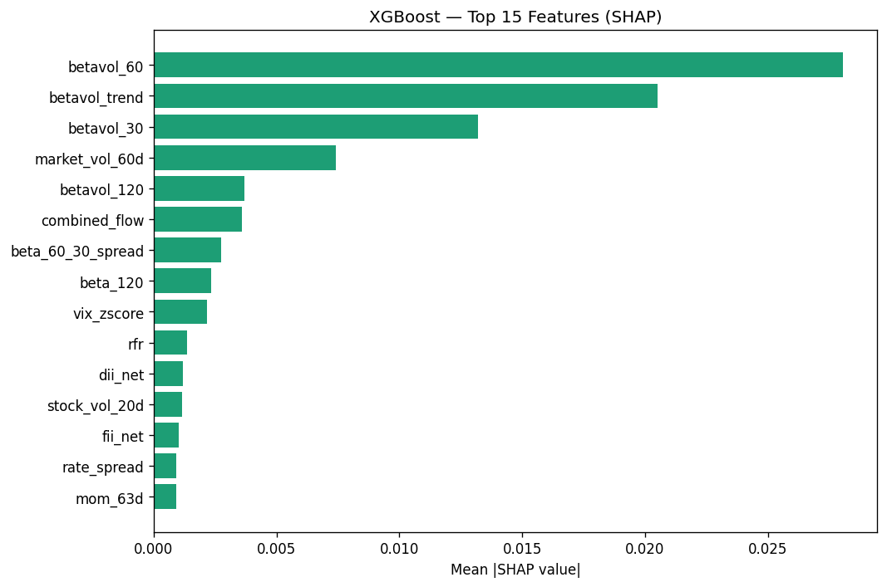
</div>

<details>
<summary><b>🧬 &nbsp;Expand: the full 42-feature universe (mindmap)</b></summary>

<br/>

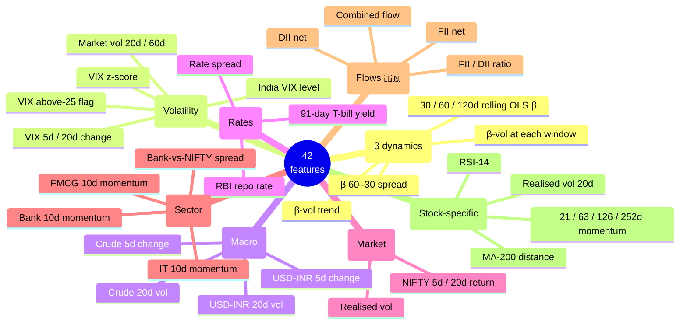

</details>

---

## 📊 Results — Walk-Forward, Out-of-Sample

<div align="center">

`Data 2015-01-02 → 2026-02-23` &nbsp;·&nbsp; `OOS 2022-01-03 → 2026-01-23 (1,964 days)`
`3y train → 1y test → annual roll` &nbsp;·&nbsp; `strictly chronological` &nbsp;·&nbsp; `8 bps charged on every rebalance`

</div>

### 🗺 Where Every Strategy Sits on the Risk/Return Map

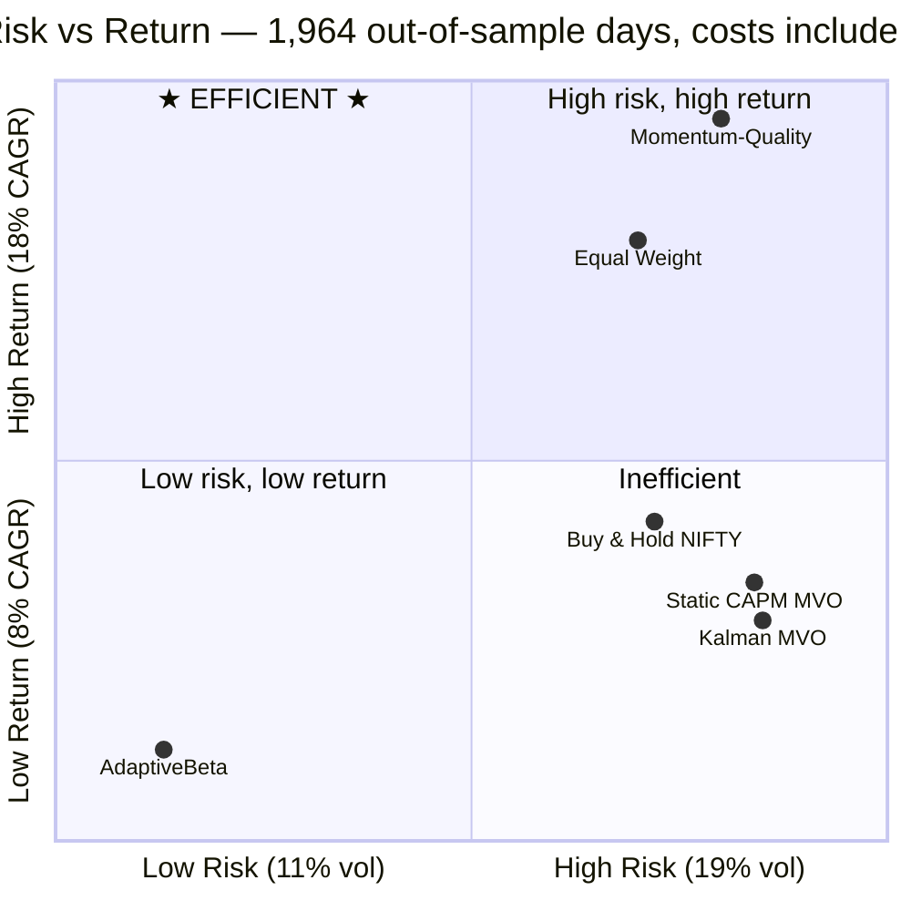

> AdaptiveBeta sits **alone on the far-left risk axis** — every other strategy is clustered at 17–18.5% volatility. It is not competing for the top-right corner; it is occupying a **risk bucket nobody else reaches**, which is exactly what a beta-targeted overlay is supposed to do.

### 🏁 The Scoreboard

<div align="center">

| Strategy | CAGR | Sharpe | Sortino | Max DD | Calmar | Ann. Vol | α | β |
|:---|:---:|:---:|:---:|:---:|:---:|:---:|:---:|:---:|
| 🛡️ **AdaptiveBeta** | 9.24% | 0.785 | **1.047** 🥇 | **−17.36%** 🥇 | **0.532** 🥇 | **11.26%** 🥇 | **+4.24%** | **0.40** |
| Static CAPM MVO | 11.38% | 0.587 | 0.716 | −35.33% | 0.322 | 18.35% | +1.19% | 0.84 |
| Kalman-β MVO | 10.92% | 0.561 | 0.676 | −35.44% | 0.308 | 18.48% | +0.58% | 0.85 |
| Equal Weight | 15.86% | 0.864 | 0.992 | −38.23% | 0.415 | 17.04% | +3.85% | 0.95 |
| Buy & Hold NIFTY-50 | 12.16% | 0.668 | 0.781 | −38.44% | 0.316 | 17.19% | — | 1.00 |
| Momentum-Quality | 17.47% | **0.893** 🥇 | 1.028 | −38.51% | 0.454 | 18.03% | +4.90% | 0.92 |

**🏅 Medal count** &nbsp;·&nbsp; AdaptiveBeta **4×🥇** &nbsp;·&nbsp; Momentum-Quality **1×🥇** &nbsp;·&nbsp; everyone else **0**

</div>

### 📉 Max Drawdown — The Headline Chart

```
                     ← smaller is better

🛡️ AdaptiveBeta      ██████████████                          −17.36%   🥇
   Static CAPM MVO   ████████████████████████████            −35.33%
   Kalman-β MVO      ████████████████████████████            −35.44%
   Equal Weight      ██████████████████████████████          −38.23%
   Buy & Hold NIFTY  ██████████████████████████████          −38.44%
   Momentum-Quality  ██████████████████████████████          −38.51%
                     └────┴────┴────┴────┴────┴────┴────┘
                     0   -8  -16  -24  -32  -40 %

                     ⟹ 2.2× shallower than the index
```

<table>
<tr>
<td width="50%" valign="top">

**📊 Annual volatility** *(lower better)*
```
AdaptiveBeta   ███████████████         11.26% 🥇
Equal Weight   ███████████████████████ 17.04%
NIFTY-50       ███████████████████████ 17.19%
Momentum-Q     ████████████████████████ 18.03%
Static MVO     █████████████████████████ 18.35%
Kalman MVO     █████████████████████████ 18.48%
```

</td>
<td width="50%" valign="top">

**📈 CAGR** *(higher better)*
```
Momentum-Q     █████████████████████████ 17.47%
Equal Weight   ███████████████████████  15.86%
NIFTY-50       █████████████████        12.16%
Static MVO     ████████████████         11.38%
Kalman MVO     ████████████████         10.92%
AdaptiveBeta   █████████████             9.24%
```

</td>
</tr>
<tr>
<td width="50%" valign="top">

**⚖️ Sortino** *(higher better)*
```
AdaptiveBeta   █████████████████████████ 1.047 🥇
Momentum-Q     ████████████████████████  1.028
Equal Weight   ████████████████████████  0.992
NIFTY-50       ███████████████████       0.781
Static MVO     █████████████████         0.716
Kalman MVO     ████████████████          0.676
```

</td>
<td width="50%" valign="top">

**🎯 Calmar** *(higher better)*
```
AdaptiveBeta   █████████████████████████ 0.532 🥇
Momentum-Q     █████████████████████     0.454
Equal Weight   ████████████████████      0.415
Static MVO     ███████████████           0.322
NIFTY-50       ███████████████           0.316
Kalman MVO     ██████████████            0.308
```

</td>
</tr>
</table>

<div align="center">
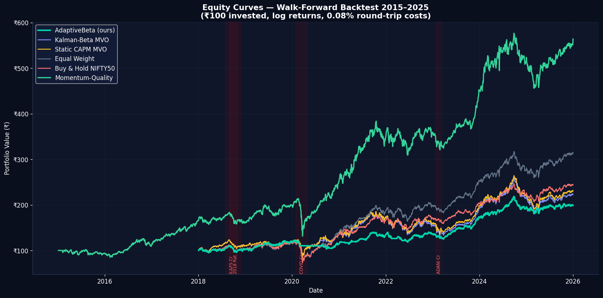
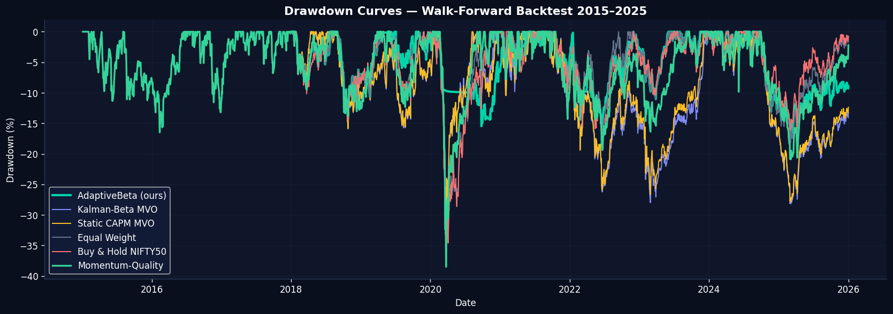
<br/>
<sub><i>Left: cumulative wealth. Right: the underwater plot — where AdaptiveBeta separates, and separates decisively.</i></sub>
</div>

### 🧭 Reading These Results Honestly

<div align="center">

> ## AdaptiveBeta does **not** have the highest CAGR.
> ## It was never designed to.

</div>

It runs at a market beta of **0.40** — structurally **~60% less exposed** to the index than every benchmark in the table. Across a 2022–2026 window in which Indian equities generally rose, *any* defensive strategy trails a long-only book on raw return. **That is arithmetic, not underperformance.**

The question that actually matters is **what you got in exchange**:

<div align="center">

| vs Buy & Hold NIFTY-50 | Δ | Visual |
|:---|:---:|:---|
| CAGR given up | −2.9 pts | `███` 🔻 |
| **Max drawdown avoided** | **−21.1 pts** | `██████████████████████` 🟢 |
| **Volatility removed** | **−5.9 pts** | `██████` 🟢 |
| **Sortino gained** | **+34%** | `█████████` 🟢 |
| **Calmar gained** | **+68%** | `██████████████████` 🟢 |
| **Alpha generated** | **+4.24%** *at β = 0.40* | `█████` 🟢 |

</div>

> **Give up 2.9 points of return. Remove 21 points of drawdown.**
>
> On a leverage-adjusted basis this is the strongest risk-adjusted book in the comparison set: an 11.26%-vol strategy *can* be levered toward benchmark volatility — a −38% drawdown **cannot be un-levered after the fact.**

### 🔥 Stress Testing — The Real Test

Four genuine Indian-market dislocations, all inside the walk-forward out-of-sample window.

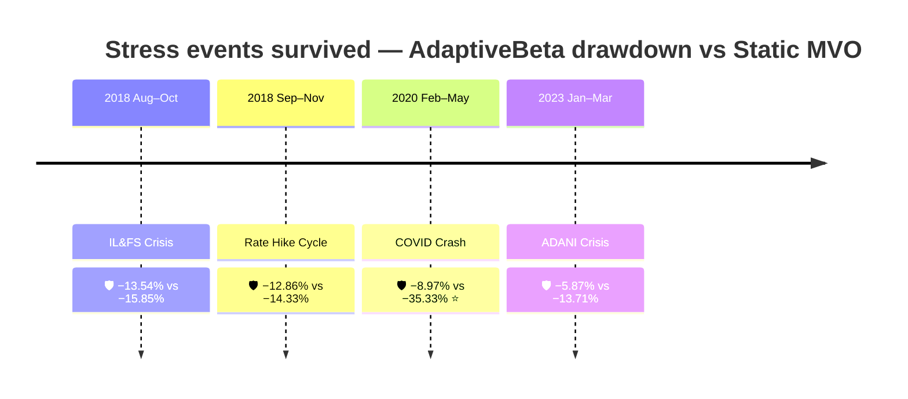

<div align="center">

### 💥 COVID Crash — max drawdown, Feb–May 2020

```
🛡️ AdaptiveBeta      ███████                                −8.97%   ⭐
   Static CAPM MVO   ████████████████████████████          −35.33%
   Kalman-β MVO      ████████████████████████████          −35.44%
   Equal Weight      █████████████████████████████         −37.63%
   Buy & Hold NIFTY  █████████████████████████████         −37.63%
   Momentum-Quality  ██████████████████████████████        −38.51%

   ⟹ a 26-POINT drawdown differential in the worst equity event of the decade
```

**The VIX override fired, min-variance engaged, and the book de-risked *while the crash was happening* — not after.**

</div>

<details>
<summary><b>📋 &nbsp;Expand: full stress table — all 4 events × 6 strategies</b></summary>

<br/>

| Event | 🛡️ **AdaptiveBeta** | Static MVO | Kalman MVO | Equal Wt | NIFTY-50 | Momentum-Q |
|:---|:---:|:---:|:---:|:---:|:---:|:---:|
| **COVID Crash** *(Feb–May 2020)* | | | | | | |
| ↳ Cumulative return | **−7.18%** 🥇 | −10.42% | −10.56% | −18.94% | −17.57% | −15.47% |
| ↳ Max drawdown | **−8.97%** 🥇 | −35.33% | −35.44% | −37.63% | −37.63% | −38.51% |
| **ADANI Crisis** *(Jan–Mar 2023)* | | | | | | |
| ↳ Cumulative return | −6.66% | −10.19% | −11.07% | −6.66% | **−6.33%** | −6.56% |
| ↳ Max drawdown | **−5.87%** 🥇 | −13.71% | −14.25% | −5.87% | −5.90% | −7.08% |
| **2018 Rate Hike** *(Sep–Nov 2018)* | | | | | | |
| ↳ Cumulative return | −7.51% | −9.61% | −9.86% | −7.51% | **−6.88%** | −8.75% |
| ↳ Max drawdown | −12.86% | −14.33% | −14.43% | −12.86% | −13.45% | **−12.44%** |
| **IL&FS Crisis** *(Aug–Oct 2018)* | | | | | | |
| ↳ Cumulative return | **−6.01%** 🥇 | −7.91% | −7.89% | −6.01% | −8.54% | −6.42% |
| ↳ Max drawdown | **−13.54%** 🥇 | −15.85% | −15.90% | −13.54% | −14.55% | −13.84% |

**Smallest max drawdown in 3 of 4 events. Smallest loss in 2 of 4. Never worse than −7.51% in any crisis.**

</details>

<div align="center">
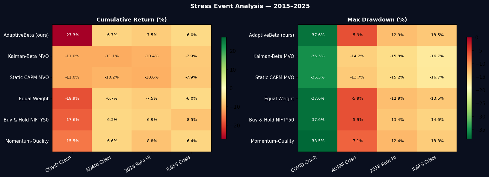
</div>

### 🌀 Regime Detection & Signal Behaviour

<div align="center">
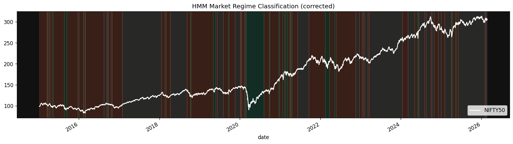
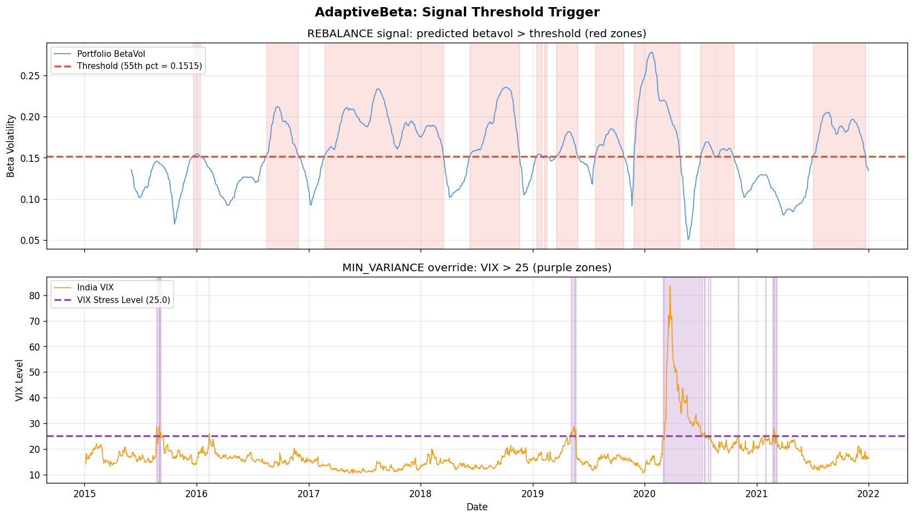
<br/>
<sub><i>Left: unsupervised HMM regime timeline, 2015–2026. Right: predicted β-vol against the frozen Q70 trigger.</i></sub>
</div>

```
   TRADING ACTIVITY — 1,719 signal days

   😴 HOLD          ████████████████████████████████████  59.6%   1,025 days   ₹0 cost
   ⚖️ REBALANCE     ████████████████                      26.9%     463 days   8 bps
   🛡️ MIN_VARIANCE  ████████                              13.4%     231 days   8 bps

   ⟹ nearly 60% of days need no trade at all — the source of the cost edge
```

<details>
<summary><b>📐 &nbsp;Expand: optimiser-mode diagnostic snapshot (and why one number needs a caveat)</b></summary>

<br/>

Cross-sectional comparison of the three optimiser modes on the same covariance estimate at **2021-12-31**:

| Mode | Expected Return* | Ann. Vol | Sharpe* | Portfolio β | # Stocks | Max Weight |
|:---|:---:|:---:|:---:|:---:|:---:|:---:|
| Max-Sharpe (β-constrained) | 60.83%* | 17.34% | 3.133* | 0.850 | 11 | 15.0% |
| Min-Variance | 12.38% | 10.84% | 0.542 | 0.602 | 21 | 15.0% |
| Risk-Parity | 12.38% | 10.84% | 0.542 | 0.602 | 21 | 15.0% |

> ⚠️ **Read with care.** These are *in-sample optimiser objective values* at a single date, derived from historical mean returns — the classic Markowitz estimation-error inflation, **not realised performance**. They are included purely as an optimiser diagnostic. The realised, cost-inclusive, out-of-sample numbers are in [the scoreboard](#-the-scoreboard).
>
> Risk-Parity fell back to Min-Variance weights at this date (CVXPY found no feasible risk-parity solution for that covariance conditioning) — **logged, not silently swallowed.**

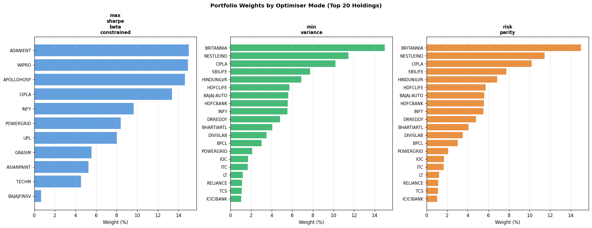

</details>

<div align="center">
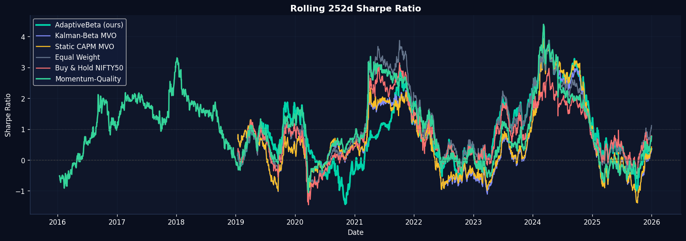
<br/><sub><i>1-year rolling Sharpe — stability of the risk-adjusted profile through time.</i></sub>
</div>

---

## 🔬 Methodological Rigour

Everything below exists to make the results **believable**, not flattering.

<table>
<tr><td width="4%">✅</td><td width="28%"><b>Walk-forward CV</b></td><td>3-year train → 1-year test → annual roll. Retrained each window; never sees its test year.</td></tr>
<tr><td>✅</td><td><b>Zero lookahead</b></td><td>Strictly chronological splits. Time series <b>never</b> shuffled. Targets forward-shifted 20 days.</td></tr>
<tr><td>✅</td><td><b>Costs charged</b></td><td>8 bps round-trip on turnover at every rebalance — no frictionless fantasy.</td></tr>
<tr><td>✅</td><td><b>Threshold frozen</b></td><td>Q70 = 0.1794 calibrated on <i>training-period</i> predictions only, then locked.</td></tr>
<tr><td>✅</td><td><b>Scaler fit on train only</b></td><td><code>StandardScaler</code> fitted on train, applied to test — no distributional leakage.</td></tr>
<tr><td>✅</td><td><b>Shrinkage covariance</b></td><td>Ledoit-Wolf on all 49×49 estimates — sample covariance is unusable at this ratio.</td></tr>
<tr><td>✅</td><td><b>Survivorship handled</b></td><td>TMPV.NS excluded (87 post-demerger rows). HDFCLIFE / SBILIFE pre-IPO rows explicitly zero-return, not silently filled.</td></tr>
<tr><td>✅</td><td><b>Data quirks documented</b></td><td>WTI's negative 2020-04-20 print clipped to 0. FII/DII monthly flows forward-filled with the ≤1-month lag stated openly.</td></tr>
<tr><td>✅</td><td><b>Reproducible</b></td><td>All seeds fixed at 42. Device auto-detect: CUDA → MPS → CPU.</td></tr>
<tr><td>✅</td><td><b>Six benchmarks, not one</b></td><td>Including two that beat us on CAGR — reported, not hidden.</td></tr>
</table>

<details>
<summary><b>⚖️ &nbsp;Expand: known limitations (stated plainly)</b></summary>

<br/>

A backtest that claims no weaknesses is a backtest nobody examined.

- **Long-only, no leverage.** The natural next step is vol-targeting AdaptiveBeta up to benchmark volatility, where its risk-adjusted edge would translate into absolute return.
- **Single market, single universe.** NIFTY-50 constituents only; cross-market generalisation untested.
- **Monthly FII/DII flows** forward-filled to daily — up to a one-month information lag on that feature group.
- **Close-price execution** assumed; no intraday microstructure or partial-fill modelling.
- **Fixed 8 bps cost model** does not scale with order size or liquidity conditions.
- **Regime labels are unsupervised** — HMM states interpreted post-hoc by sorted mean return, not validated against an external regime taxonomy.

</details>

---

## ⚡ Quickstart

```bash
# 1 ─ Clone
git clone https://github.com/daishinkan7/FinTech_AdaptiveBeta.git
cd FinTech_AdaptiveBeta

# 2 ─ Environment
python -m venv venv && source venv/bin/activate      # Windows: venv\Scripts\activate
pip install -r requirements.txt

# 3 ─ Run everything
python run_pipeline.py
```

<div align="center">

| Stage | Script | ⏱ Runtime | Produces |
|:--:|:---|:---:|:---|
| **01** | `01_feature_engineering.py` | `~10 s` | 118,719 × 44 stacked feature matrix |
| **02** | `02_train_models.py --device auto` | `~8–10 min` | XGBoost · LSTM · Kalman · HMM + SHAP |
| **03** | `03_portfolio_optimisation.py` | `~1 s` | Validated weights, all three modes |
| **04** | `04_backtest.py` | `~25–30 min` | Walk-forward results, metrics, 12 charts |

</div>

```bash
python run_pipeline.py --device cpu    # force CPU
python run_pipeline.py --fast          # skip Kalman betas (~20 min saved)
python run_pipeline.py --start 3       # resume from stage 03
```

<sub>**Stage 02 flags:** `--device {auto,cuda,mps,cpu}` · `--epochs N` · `--fast` (skip Kalman) · `--no-xgb` (skip XGBoost + SHAP)</sub>

<details>
<summary><b>📥 &nbsp;Expand: data layout</b></summary>

<br/>

```
data/
├── 📈 stocks/    all_stocks_prices.csv · all_stocks_volume.csv
├── 📊 market/    nifty50.csv · india_vix.csv
├── 🌍 macro/     usdinr.csv · crude_oil.csv · risk_free_rate_91d_daily.csv · repo_rate_daily.csv
├── 💱 flows/     fii_flows.csv · dii_flows.csv                    (monthly)
└── 🏭 sector/    nifty_bank.csv · nifty_it.csv · nifty_fmcg.csv
```

**Minimum viable input:** `stocks/all_stocks_prices.csv` + `market/nifty50.csv`.
Macro, flow and sector feeds **degrade gracefully** — the pipeline drops those feature groups with a warning rather than crashing.

</details>

---

## 🖥 Three Ways to Explore

<table>
<tr>
<td width="33%" align="center" valign="top">

### 🌐 &nbsp;Next.js Research Site

Production site with architecture walkthrough, results, and a **browser-side interactive strategy simulator** driven by real exported backtest data.

```bash
cd website
npm install && npm run dev
```
**`localhost:3000`**

<sub>Next 14 · TypeScript · Tailwind<br/>Recharts · Framer Motion</sub>

</td>
<td width="33%" align="center" valign="top">

### 📊 &nbsp;Plotly Dash Analyst App

Full dashboard — equity curves, drawdowns, regime timeline, SHAP explorer, live signal inspection.

```bash
python app.py
```
**`localhost:8050`**

<sub>Dash · Bootstrap · Plotly</sub>

</td>
<td width="33%" align="center" valign="top">

### 🧪 &nbsp;Strategy Lab

Threshold sweeps, VIX-override sensitivity and regime-routing what-ifs — for probing *why* the strategy behaves as it does.

```
src/dashboard/strategy_lab.py
```

<sub>Parameter-sensitivity tooling</sub>

</td>
</tr>
</table>

---

## 📁 Repository Map

```
FinTech_AdaptiveBeta/
│
├── 📂 src/                          ← layered library (the real codebase)
│   ├── ⚙️  config.py                 ← single source of truth: paths, tickers, hyperparams
│   ├── 📥 data/       loader.py · validator.py
│   ├── 🔧 features/   returns.py · beta.py · macro.py · momentum.py
│   ├── 🧠 models/     xgboost_model.py · lstm.py · kalman.py · hmm_regime.py
│   ├── 💼 portfolio/  signal.py · optimiser.py · constraints.py
│   ├── 🔄 backtest/   engine.py · metrics.py · transaction_costs.py
│   ├── 📊 dashboard/  layout.py · callbacks.py · charts.py · data_service.py · strategy_lab.py
│   └── 🛠️  utils/      logging.py · plotting.py
│
├── 📂 scripts/         01 features → 02 train → 03 optimise → 04 backtest
├── 📂 data/            raw market / macro / flow / sector CSVs
├── 📂 features/        computed panels: β, β-vol, Kalman β, HMM regimes, targets
├── 📂 models/          xgb_model.pkl · lstm_best.pt · scaler.pkl · signal_config.json
├── 📂 results/         metrics CSVs + 12 publication-grade charts
├── 📂 website/         Next.js 14 research site + interactive demo
├── 📂 docs/            SETUP_GUIDE.md · RESULTS.md (full run log)
│
├── 🚀 run_pipeline.py  master orchestrator
├── 📊 app.py           Plotly Dash dashboard
└── 📋 requirements.txt
```

<div align="center">

<table>
<tr>
<td align="center" width="25%"><h3>11.3k</h3><sub><b>lines of Python</b><br/>layered package</sub></td>
<td align="center" width="25%"><h3>4.85k</h3><sub><b>lines of TS/React</b><br/>Next.js 14 site</sub></td>
<td align="center" width="25%"><h3>4</h3><sub><b>model families</b><br/>GBM · DL · state-space · latent</sub></td>
<td align="center" width="25%"><h3>42</h3><sub><b>engineered features</b><br/>8 groups</sub></td>
</tr>
<tr>
<td align="center"><h3>49</h3><sub><b>equities</b><br/>NIFTY-50 universe</sub></td>
<td align="center"><h3>2,744</h3><sub><b>trading days</b><br/>2015 → 2026</sub></td>
<td align="center"><h3>6</h3><sub><b>benchmark strategies</b><br/>incl. 2 that beat us</sub></td>
<td align="center"><h3>4</h3><sub><b>stress events</b><br/>real dislocations</sub></td>
</tr>
</table>

</div>

<details>
<summary><b>📦 &nbsp;Expand: generated artefacts</b></summary>

<br/>

| Directory | Contents |
|:---|:---|
| `features/` | `stacked_features.csv` (118,719×44) · `market_features.csv` · `beta{30,60,120}d.csv` · `betavol_*.csv` · `kalman_betas.csv` (2,743×49) · `hmm_regimes.csv` · `target_betavol_20d_ahead.csv` · `optimiser_weights_*.csv` |
| `models/` | `xgb_model.pkl` · `lstm_best.pt` · `scaler.pkl` · `feature_cols.txt` · `signal_config.json` |
| `results/` | `performance_metrics.csv` · `stress_analysis.csv` · `model_comparison.csv` · `optimiser_comparison.csv` · `signal_frequency.csv` · `shap_importance.csv` · per-strategy return series · 12 charts |

</details>

---

## 🧰 Tech Stack

<div align="center">

**Core** &nbsp;


**Models** &nbsp;


**Optimisation** &nbsp;


**Interface** &nbsp;


</div>

---

<details>
<summary><b>📚 &nbsp;References</b></summary>

<br/>

1. **Fama, E. F., & French, K. R.** (1993). Common risk factors in the returns on stocks and bonds. *Journal of Financial Economics*, 33(1), 3–56.
2. **Ang, A., & Kristensen, D.** (2012). Testing conditional factor models. *Journal of Financial Economics*, 106(1), 132–156.
3. **Kalman, R. E.** (1960). A new approach to linear filtering and prediction problems. *Journal of Basic Engineering*, 82(1), 35–45.
4. **Ledoit, O., & Wolf, M.** (2004). A well-conditioned estimator for large-dimensional covariance matrices. *Journal of Multivariate Analysis*, 88(2), 365–411.
5. **Black, F., & Litterman, R.** (1992). Global portfolio optimization. *Financial Analysts Journal*, 48(5), 28–43.
6. **Chen, T., & Guestrin, C.** (2016). XGBoost: A scalable tree boosting system. *KDD '16*.
7. **Hochreiter, S., & Schmidhuber, J.** (1997). Long short-term memory. *Neural Computation*, 9(8), 1735–1780.
8. **Lundberg, S. M., & Lee, S.-I.** (2017). A unified approach to interpreting model predictions. *NeurIPS 2017*.

</details>

---

<div align="center">

> ### ⚠️ Disclaimer
> Academic research project. Backtested results are hypothetical, carry the inherent limitations of simulated performance, and are **not** indicative of future returns. Nothing here constitutes investment advice.

**📄 License** — Released under the **MIT License**. Free to use, modify and distribute.

</div>

---

<div align="center">

## 👤 Kunal Ajgaonkar

**AI & ML Engineer** &nbsp;·&nbsp; M.Tech Capstone &nbsp;·&nbsp; Symbiosis Institute of Technology, Pune &nbsp;·&nbsp; 2026

`data engineering` → `feature research` → `model benchmarking` → `convex optimisation` → `walk-forward validation` → `production frontend`

<br/>

**If this was useful or interesting, a ⭐ goes a long way.**


</div>
